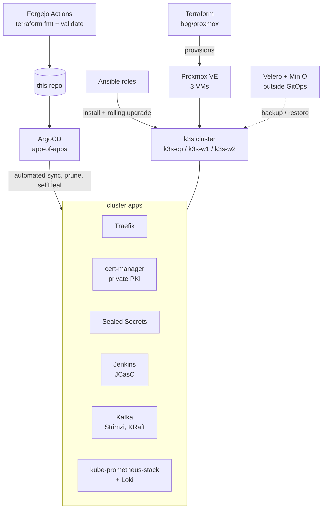

# terraform-homelab

Infrastructure-as-code for my homelab: Proxmox VMs provisioned with
Terraform, configured with Ansible, running a 3-node k3s cluster where
everything ships through ArgoCD. Velero handles disaster recovery, Forgejo
runs CI, and every real failure gets a postmortem.

## Architecture



## Layout

```
.
├── proxmox/           # Terraform: VM provisioning (bpg/proxmox, for_each-driven)
├── docker/            # Terraform: standalone Docker workloads
├── ansible/           # Roles: k3s (install + rolling upgrade with drain), forgejo, runner
├── k8s/
│   ├── argocd/            # ArgoCD Helm values
│   ├── argocd-apps/       # App-of-apps: root.yaml + child Applications
│   ├── cert-manager/      # Private PKI: self-signed -> Root CA -> cluster issuer
│   ├── kafka/             # Strimzi KafkaNodePool / Kafka / KafkaTopic (KRaft mode)
│   ├── jenkins/           # Jenkins admin credentials as a SealedSecret
│   ├── monitoring/        # kube-prometheus-stack values
│   └── loki/              # Loki values + Grafana datasource
├── gitops/apps/       # Demo app manifests delivered via ArgoCD
├── .forgejo/          # CI workflow: terraform fmt + validate on push / PR
├── INCIDENTS.md       # Postmortems of real failures
└── dr-drill-report.md # Velero DR drill evidence log (RTO ~18s)
```

## GitOps flow

`k8s/argocd-apps/root.yaml` is the app-of-apps: a single root Application
that watches that directory and manages every child Application — Traefik,
cert-manager, Sealed Secrets, Jenkins, the Strimzi operator and the Kafka
cluster, monitoring. Sync is automated with prune and selfHeal; ordering is
handled with sync-waves where it matters (operator before cluster CRs).
Editing a manifest and pushing to main is the whole deployment process.

Secrets live in Git as SealedSecrets. The controller's private key never
leaves the cluster.

## CI

Jenkins (Helm chart, configured via JCasC, ephemeral pod agents — one pod
per build) does CI; CD stays with ArgoCD. Forgejo Actions runs
`terraform fmt` and `validate` on every push and pull request. Renovate
keeps chart and provider versions honest.

## Disaster recovery

Velero + MinIO (S3), installed imperatively and on purpose **outside** the
GitOps flow: recovery tooling should not depend on the thing it may have to
recover. A full backup → delete → restore → verify drill was executed and
timed. **RTO: ~18 seconds.** Evidence log with real command output:
[dr-drill-report.md](dr-drill-report.md).

The k3s control-plane datastore (SQLite via kine) is backed up separately
with `sqlite3 .backup` plus integrity verification.

## Incidents

Real failures, written up postmortem-style (symptom → diagnosis → root
cause → fix → prevention): [INCIDENTS.md](INCIDENTS.md). Highlights: a
Terraform plan that said "update in-place" and executed destroy+recreate,
and a cluster-wide Go SIGSEGV that turned out to be a missing CPU
instruction set.

## Status

Live lab, actively maintained. Things break here on purpose — and sometimes
by surprise. That's what INCIDENTS.md is for.
